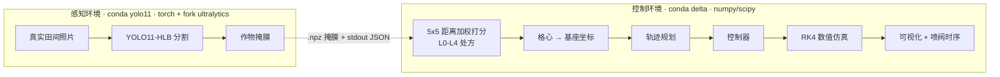

# delta-spray-arm

Delta 并联臂的视觉靶向喷药闭环：真实田间照片 → 作物分割与变量施药处方 → 轨迹规划 → 控制器 →
自写数值仿真。目标是在仿真里跑通「看见杂草 → 决定喷哪几格 → 臂走过去并且只在稳定时喷」这条完整链路。

**当前状态**：前期准备完成，W1（运动学与数值仿真）进行中。感知侧链路已跑通并与论文实现逐元素对拍，
控制侧运动学有 32 条测试；端到端演示与视频还没有。

## 架构



两条链路**故意跑在不同 Python 环境**，中间只隔一个文件契约，理由见下一节。

## 为什么是两个环境、不用物理引擎、不控姿态

| 决策 | 理由 |
|---|---|
| 感知与控制分开部署 | 改进权重 `best_hlb.pt` 含自定义模块，必须用 `sys.path` 前置的 fork ultralytics(8.3.15) 才能反序列化，那是 AGPL 且拖着 torch。控制侧保持轻、干净、可复现，换机器不受影响 |
| 自写 RK4 数值仿真 | Delta 是闭链机构，在物理引擎里搭平行四边形约束会长期漂移。自己写 `M(q)q̈ = τ − Cq̇ − g` 约 200 行 numpy，噪声与延迟可以精确注入 |
| 姿态全程常量 `R = I` | 喷药作业末端恒向下。四元数、位姿同步插补全部推到本阶段之外，是 8 周内做完的最大杠杆 |

跨环境的契约只有一条：`perception_worker.py` 在感知环境里推理并把作物掩膜写成 `.npz`，
控制侧 `perception.crop_mask()` 读回来。**控制仓库不 import ultralytics。**

## 快速开始

```bash
# 控制侧
conda create -n delta python=3.11 && conda activate delta
pip install -r requirements.txt
python -m pytest -q                     # 32 passed，纯 CPU，不需要模型

# 生成一张处方图（离线模式：用已有掩膜，不需要 GPU 和权重）
python scripts/run_prescription.py <某张方形田间图> --mask <crop_mask.npz> --out prescription.json

# 完整链路（需要装了 torch 的感知环境 + fork ultralytics + HLB 权重）
python scripts/run_prescription.py <图> --python <感知环境python> \
       --weights <best_hlb.pt> --ultralytics-root <含 ultralytics 包目录的上级>
```

输出的 `prescription.json` 含 5×5 等级矩阵、每格加权得分，以及过滤后的喷施点列表
`(i, j, level, score, x_m, y_m)` —— 它就是轨迹规划的输入契约。

## 模块地图

| 模块 | 内容 | 状态 |
|---|---|---|
| `src/delta/spray_map.py` | 作物掩膜 + 图像 → 5×5 处方（EXG/HSV、距离加权、剂量分级、保护区、格心坐标）。纯函数，零推理依赖 | ✅ |
| `src/delta/kinematics.py` | 闭式 IK（锁解支）、三球交点 FK、逆雅可比、传动裕度、标量 Newton 数值 IK 交叉验证 | ✅ |
| `src/delta/perception.py` | 跨环境桥接：调感知侧 worker，读回 `.npz` 掩膜 | ✅ |
| `scripts/perception_worker.py` | 在感知环境里运行，图像 → 掩膜 + provenance | ✅ |
| `scripts/run_prescription.py` | 处方图命令行入口 | ✅ |
| `src/delta/dynamics.py` `simulator.py` `controller.py` `trajectory.py` `viz.py` | 简化动力学 / RK4 积分 / PD+前馈与计算力矩 / 轨迹规划 / 线框动画 | 🔲 尚未创建，W1–W2 按里程碑逐个建 |
| `notes/` | 项目契约，见下节 | ✅ |
| `assets/` | 演示 GIF 与结果图 | 🔲 W5 |

## 文档

代码服从 `notes/`，改约定必须和改代码走同一个 commit。

- [`notes/00-conventions.md`](notes/00-conventions.md) — 坐标系（原点静平台中心、Z 向上为正、X 指向 1 号臂）、单位、关节角零位与正方向、IK 解支、工作空间与传动裕度地形、**告警阈值 `min sin μ ≥ 0.25`**、eye-in-hand 相机外参、视场与网格、决策分辨率政策、与 MATLAB 的差异登记表。
- [`notes/01-model.md`](notes/01-model.md) — MATLAB 侧运动学约定与 GA 结构优化结果的完整复原：设计变量与约束、目标函数、`delta_result.mat` 各项含义、以及用闭式 IK 复算后的可达边界与传动地形对照。

结构参数（GA 优化，样机）：静平台 `R = 138.12 mm`、动平台 `r = 133.12 mm`、主动臂 `L1 = 406.68 mm`、
从动臂 `L2 = 582.08 mm`、三臂共用限位 `[−35.55°, 90°]`，设计目标为静平台下方 350~800 mm 深度内
包络 600×600 mm 作业面。

## 已知边界与未定项

- 视场暂按 **600 × 600 mm**（与结构优化的目标框同源），最终值要由相机工作高度与镜头视场角反算。
- 相机与喷头**同装在动平台**上（eye-in-hand），观测与喷施分两个高度，所以像素→地面映射用的是拍照瞬间的相机高度，而相机—末端外参是刚性常量。
- 感知侧单次子进程往返 6~9 s（其中约 3 s 是 `import torch`），只适合离线生成处方；真闭环需常驻进程。
- 尚未验证的：实物装配落在哪条解支、静平台离地高度、喷杆长度、相机模组参数、图像行序与臂 Y 轴的对应关系。逐条列在 `00-conventions.md` 第 12 节。

## 关于第三方代码

仓库不包含 ultralytics 及其 fork 的任何副本。改进权重的自定义模块（Hybrid_Lite / CA / RCCA）
由感知侧环境通过 `sys.path` 前置加载，本仓库只消费它写出的掩膜文件。
